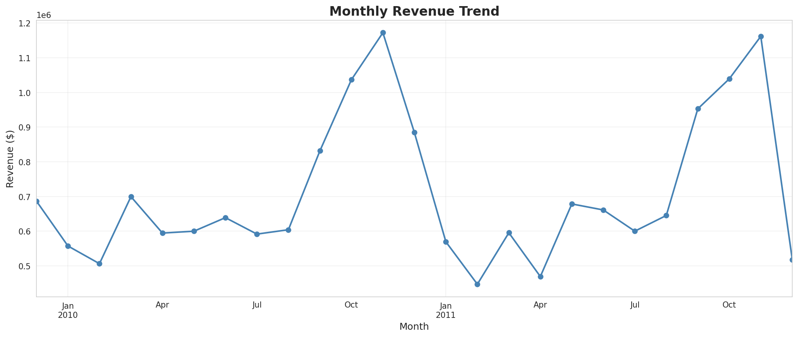
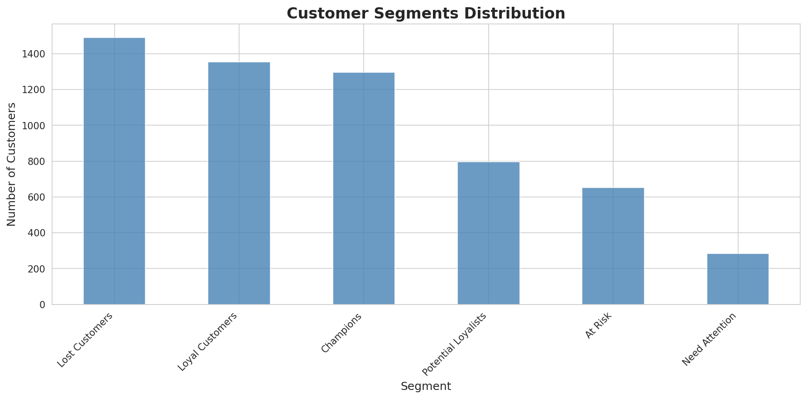
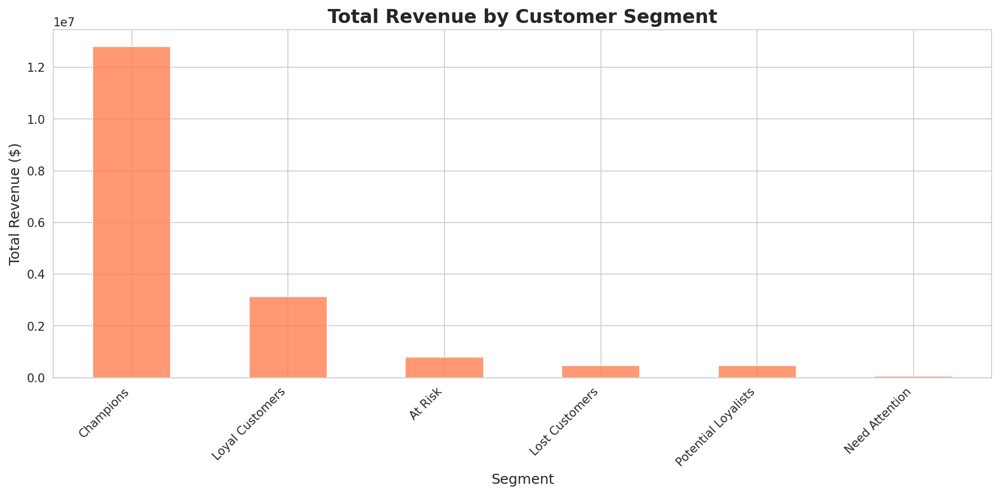
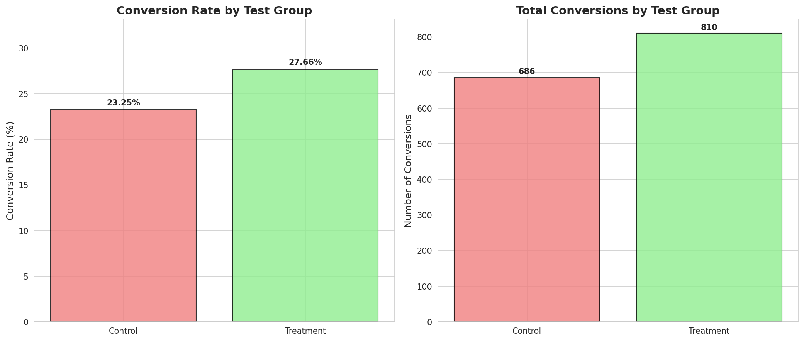

<div align="center">

# 🛍️ E-Commerce Customer Analytics

### RFM Segmentation · Behavioral Insights · A/B Test Simulation

*Turning 1M+ raw transactions into a data-driven customer strategy*


[Overview](#-overview) · [Key Insights](#-key-insights) · [Visuals](#-visuals) · [Power BI Dashboard](#-power-bi-dashboard) · [How to Run](#%EF%B8%8F-how-to-run) · [Methodology](#-methodology) · [Project Structure](#-project-structure)

</div>

---

## 📌 Overview

This project analyzes **1.07 million transaction records** from a UK-based online gift retailer (Dec 2009 – Dec 2011) to answer two questions every e-commerce business asks:

> **"Which customers actually matter — and are we investing in the right ones?"**
> **"Would a checkout redesign really convert better, or does it just feel that way?"**

The pipeline cleans the raw data, explores buying behavior, builds an **RFM (Recency · Frequency · Monetary)** model to segment every customer, and runs a **statistically validated A/B test simulation** to demonstrate how a UX change should be evaluated before shipping it.

| | |
|---|---|
| 🗂️ **Dataset** | [UCI Online Retail II](https://archive.ics.uci.edu/dataset/502/online+retail+ii) — 1,067,371 raw transaction lines |
| 🧹 **After cleaning** | 805,549 transactions · 5,878 customers · 4,631 products |
| 📅 **Time span** | December 2009 – December 2011 |
| 💰 **Total revenue analyzed** | $17,743,429.18 |
| 🧰 **Stack** | Python · pandas · NumPy · Matplotlib · Seaborn · SciPy |

---

## 💡 Key Insights

<table>
<tr><td width="55">🏆</td><td><b>22% of customers drive ~72% of revenue.</b> The "Champions" segment (1,297 customers) generated $12.81M of the $17.74M total — a textbook Pareto concentration.</td></tr>
<tr><td>⚠️</td><td><b>1 in 4 customers has effectively churned.</b> "Lost Customers" is the single largest segment by headcount (25.4%), a clear win-back — or write-off — target.</td></tr>
<tr><td>🔁</td><td><b>72.4% of customers are repeat buyers</b> — averaging 6.29 purchases each, a healthy retention base to build loyalty programs on.</td></tr>
<tr><td>🎄</td><td><b>Revenue is sharply seasonal</b>, peaking at $1.17M in November 2010 (pre-holiday buying) and bottoming out at $447K in February 2011.</td></tr>
<tr><td>🌍</td><td><b>The business is UK-domestic</b> — the UK alone accounts for ≈$14.72M, dwarfing the next closest market (EIRE, ≈$621K).</td></tr>
<tr><td>🧪</td><td><b>A simulated checkout redesign lifts conversion ~19%</b> (23.25% → 27.66%), confirmed statistically significant via chi-square test (p = 0.0001).</td></tr>
</table>

> ⚠️ **Honest disclaimer:** The A/B test above is a *simulation* — the source dataset contains no real experiment data. It's included to demonstrate correct A/B-testing methodology (random assignment, lift calculation, significance testing), not as an observed business result.

---

## 📊 Visuals

<table>
<tr>
<td width="50%"></td>
<td width="50%"></td>
</tr>
<tr>
<td align="center"><sub>Monthly revenue trend — clear holiday seasonality</sub></td>
<td align="center"><sub>Customer segment distribution (RFM)</sub></td>
</tr>
<tr>
<td width="50%"></td>
<td width="50%"></td>
</tr>
<tr>
<td align="center"><sub>Champions drive the majority of revenue</sub></td>
<td align="center"><sub>Simulated checkout A/B test — conversion lift</sub></td>
</tr>
</table>

<details>
<summary><b>See all 12 charts</b></summary>
<br>

| Chart | File |
|---|---|
| Monthly Revenue Trend | `images/monthly_revenue_trend.png` |
| Top 10 Countries by Revenue | `images/top_10_countries_by_revenue.png` |
| Top 10 Best-Selling Products | `images/top_10_best_selling_products.png` |
| Transaction Amount Distribution | `images/transaction_amount_distribution.png` |
| Revenue by Day of Week | `images/revenue_by_day_of_week.png` |
| Customer Purchase Frequency | `images/customer_purchase_frequency_distribution.png` |
| Top 20 Customers by Revenue | `images/top_20_customers_by_revenue.png` |
| Transaction Distribution + Box Plot | `images/transaction_amount_distribution_and_boxplot.png` |
| Customer Segments Distribution | `images/customer_segments_distribution.png` |
| Revenue by Segment | `images/segment_revenue_comparison.png` |
| A/B Test Results | `images/ab_test_results.png` |
| Conversion Rate by Segment | `images/conversion_rate_by_segment.png` |

</details>

---

## 🧠 Methodology

```
Raw Data (1,067,371 rows)
   │
   ├─▶ Data Cleaning        remove cancellations → missing IDs → bad qty/price
   │                        1,067,371 → 805,549 rows
   │
   ├─▶ Feature Engineering  TotalAmount = Quantity × Price · date parts
   │
   ├─▶ Exploratory Analysis revenue trends · geography · products · order value
   │
   ├─▶ RFM Modeling         Recency · Frequency · Monetary → quantile scores (1–5)
   │
   ├─▶ Segmentation         rule-based → 6 customer segments
   │
   ├─▶ A/B Test Simulation  Control vs. Treatment → chi-square significance test
   │
   └─▶ Insights & Recommendations
```

### Customer Segments (RFM)

| Segment | Customers | % | Avg. Monetary Value |
|---|---:|---:|---:|
| 🏆 Champions | 1,297 | 22.1% | Highest |
| 💚 Loyal Customers | 1,355 | 23.1% | High |
| 🌱 Potential Loyalists | 797 | 13.6% | Medium |
| ⚠️ At Risk | 653 | 11.1% | Medium |
| 👀 Need Attention | 285 | 4.8% | Low–Medium |
| 💤 Lost Customers | 1,491 | 25.4% | Lowest |

---

## 📈 Power BI Dashboard

A 4-page interactive dashboard built on top of the cleaned data and RFM segmentation — takes every insight from the notebook and makes it clickable, filterable, and explorable.

📥 **[Download the dashboard (.pbix)](dashboard/ecommerce-dashboard.pbix)** — open with [Power BI Desktop](https://www.microsoft.com/en-us/power-platform/products/power-bi/downloads) (free) for the full interactive version
📄 **[View the dashboard (.pdf)](dashboard/ecommerce-dashboard.pdf)** — a static, no-install preview of all 4 pages, viewable right here on GitHub

| Page | What it covers |
|---|---|
| **Executive Overview** | Revenue, orders, and customer KPIs · monthly trend · top 10 countries · customer segment mix |
| **Customer Segmentation (RFM)** | Segment size vs. segment revenue side by side · Frequency-vs-Monetary scatter by segment · full RFM summary table · Lost/At-Risk headcount call-outs |
| **Product & Sales Behavior** | Top-selling products · revenue by day of week (including the near-empty Saturday anomaly) · top customers · transaction-value histogram |
| **A/B Testing Result** | Simulated checkout redesign — conversion rate by group, relative lift %, clearly flagged as simulated data throughout |

<table>
<tr>
<td width="50%"></td>
<td width="50%"></td>
</tr>
<tr>
<td align="center"><sub>Executive Overview</sub></td>
<td align="center"><sub>Customer Segmentation (RFM)</sub></td>
</tr>
<tr>
<td width="50%"></td>
<td width="50%"></td>
</tr>
<tr>
<td align="center"><sub>Product & Sales Behavior</sub></td>
<td align="center"><sub>A/B Testing Result (simulated)</sub></td>
</tr>
</table>

> ⚠️ Same disclaimer as the notebook: the A/B test page uses **simulated** conversion data — it demonstrates correct A/B-testing methodology (random assignment, lift calculation, significance testing), not an observed real-world result.

---

## ⚙️ How to Run

```bash
# 1. Clone / download the project, then install dependencies
pip install -r requirements.txt

# 2. Launch the notebook
jupyter notebook notebooks/ecommerce_analysis.ipynb

# 3. Run all cells, top to bottom
```

> The notebook reads `../data/online_retail_II.csv` and writes results back to `../data/` and `../images/`, so run it with the working directory set to `notebooks/` — the default when opened via Jupyter.

---

## 📁 Project Structure

```
ecommerce-customer-analytics/
├── README.md
├── requirements.txt
├── .gitignore
├── notebooks/
│   └── ecommerce_analysis.ipynb    # full analysis, cleaning → insights
├── data/
│   ├── online_retail_II.csv        # raw source data
│   ├── online_retail_cleaned.csv   # cleaned transactions
│   └── rfm_analysis.csv            # per-customer RFM scores & segments
├── images/                         # all charts, auto-generated by the notebook
└── dashboard/
    ├── ecommerce-dashboard.pbix    # interactive Power BI dashboard
    ├── ecommerce-dashboard.pdf     # static preview, viewable on GitHub
    └── screenshots/                # per-page PNGs, embedded in this README
```

---

## 🎯 Business Recommendations

- **🏆 Protect Champions & Loyal Customers** — they're ~45% of customers but the clear majority of revenue; prioritize loyalty perks and early access here first.
- **💤 Target (or consciously write off) Lost Customers** — a quarter of the customer base; a win-back campaign is only worth it if the expected return beats the campaign cost.
- **🚀 Roll out the checkout redesign** — pending a *real* A/B test to confirm the simulated ~19% lift holds with actual users.
- **📦 Double down on top sellers** — stock and promote products like *World War 2 Gliders* and the *White Hanging Heart T-Light Holder*, the highest-volume items.
- **🇬🇧 Treat the UK as the core market**, with EIRE, Netherlands, and Germany as secondary growth opportunities.

---

## 🔧 Tech Stack

`Python` `pandas` `NumPy` `Matplotlib` `Seaborn` `SciPy` `Jupyter Notebook` `Power BI`

No SQL, Excel, or machine learning is used — the analysis itself is a pure Python/pandas pipeline end to end, with Power BI layered on top purely for interactive presentation of the same results.

---

## 📄 License

This project is available under the MIT License. The underlying dataset is the publicly available [UCI Online Retail II](https://archive.ics.uci.edu/dataset/502/online+retail+ii) dataset.

---

<div align="center">
<sub>Built with 🐼 pandas and ☕ curiosity</sub>
</div>
